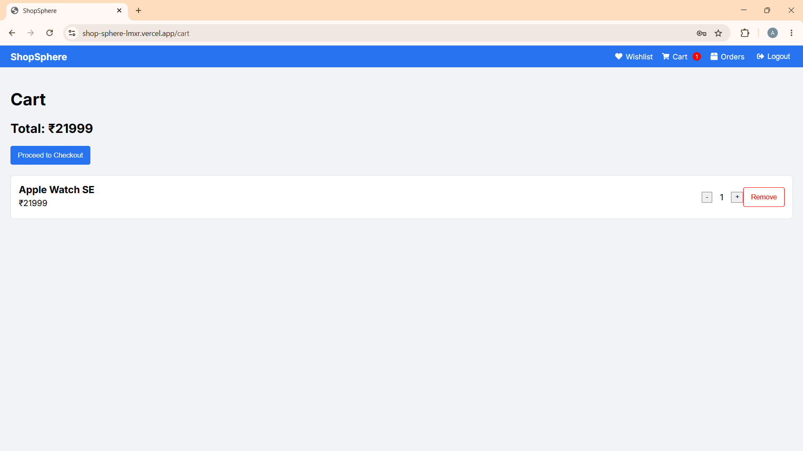

# ShopSphere — Full Stack E-Commerce Website (MERN Stack)

* Github Link: https://github.com/adilali02032005-byte/ShopSphere.git

## Overview

ShopSphere is a full-stack E-Commerce platform built using the MERN stack.

Users can browse products, search and filter items, manage their cart and wishlist, place orders, make secure online payments, and track purchases.

Administrators can manage products, inventory, users, and orders through a dedicated admin dashboard.

---

## Features

### Customer Features

* User Registration & Login
* JWT Authentication
* Browse Products
* Product Search
* Category Filtering
* Product Details Page
* Add to Cart
* Wishlist Management
* Secure Checkout
* Razorpay Payment Integration
* Order History & Tracking

### Admin Features

* Dashboard Analytics
* Product Management (CRUD)
* Inventory Management
* User Management
* Order Management
* Order Status Updates

---

## Tech Stack

### Frontend

* React.js
* Redux Toolkit
* React Router DOM
* Vite
* HTML5, CSS3

### Backend

* Node.js
* Express.js

### Database

* MongoDB Atlas
* Mongoose

### Authentication

* JWT (JSON Web Token)

### Payment Gateway

* Razorpay

---

## Project Structure

client/ -> React Frontend

server/ -> Node + Express Backend

models/ -> MongoDB Schemas

controllers/ -> Business Logic

routes/ -> API Routes

middleware/ -> Authentication & Authorization

---

## LIVE LINKS

* Frontend: https://shop-sphere-lmxr.vercel.app/
* Backend: https://shopsphere-a8pv.onrender.com/

---

## Test Credentials

### Customer

* email: test_1@mail
* password: test_1_123456

### Admin

* email: admin_1@mail
* password: admin_1_123456

---

## Installation

### 1. Clone Repository

git clone https://github.com/adilali02032005-byte/ShopSphere.git

### 2. Backend Setup

cd server

npm install

### 3. Frontend Setup

cd client

npm install

---

## Environment Variables

### Backend

Create a `.env` file inside the `server` folder:

PORT=5000

MONGO_URI=your_mongodb_connection_string

JWT_SECRET=your_secret_key

RAZORPAY_KEY_ID=your_key_id

RAZORPAY_KEY_SECRET=your_key_secret

### Frontend

Create a `.env` file inside the `client` folder:

VITE_API_URL=https://your-render-backend.onrender.com/api

---

## Running the Project

### Start Backend

cd server

npm start

### Start Frontend

cd client

npm run dev

---

## Screenshots

---

## Future Enhancements

* AI Product Recommendations
* Product Reviews & Ratings
* Multi-Vendor Marketplace
* Coupon & Discount System
* Email Notifications
* Mobile Application

---

## Note

* JWT-based authentication is implemented.
* Admin routes are protected using role-based authorization.
* Razorpay is used for payment processing.
* Product images can be stored using URLs or cloud storage services.
* MongoDB Atlas is used as the database.

---

## Author

Developed as a Full Stack Web Development Project (MERN Stack)
